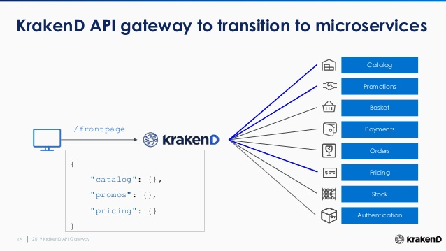
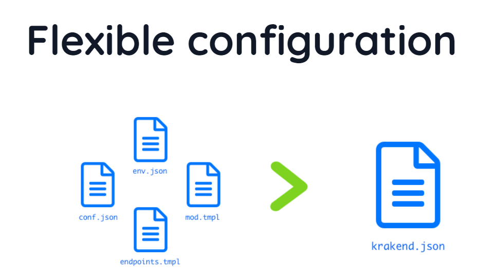

# API-Gateway



Microservice that is based on KrakenD.
It is a high-performance open source API Gateway. Its core functionality is to create an API that acts
as an aggregator of many microservices into single endpoints.

### **API-Gateway has a Flexible configuration which to let work with go template**

The activation of the package works via environment variables when running krakend, as follows:



**FC_ENABLE**=1 to let KrakenD know that you are using Flexible Configuration. You can use 1 or any other value (but 0 won’t disable it!). The file passed with the -c flag is the base template.

**FC_SETTINGS**=dirname: The path to the directory with all the settings files.

**FC_PARTIALS**=dirname: The path to the directory with the partial files included in the configuration file. Partial files DON’T EVALUATE, they are only inserted in the placeholder.

**FC_TEMPLATES**=dirname: The path to the directory with the sub-templates included in the configuration file. These are evaluated using the Go templating system.

**FC_OUT**: For debugging purposes, saves the resulting configuration of processing the flexible configuration in the given filename. Otherwise, the final file is not visible.

### API-Gateway consist of configs:

**krakend.json** (main file with endpoints, host variables and separation of endpoint by authorization)

`{{ $AmazonCognitoAdapter :="localhost:9090" }}` (to define host/port here)

partials

* authorization_admin.txt (configuration to authorization)

```
"alg": "RS256",

"cache": true,

"issuer": "https://cognito-idp.eu-west-2.amazonaws.com/eu-west-2_Yl9HrRUCK",

"roles_key": "cognito:groups",

"roles_key_is_nested": true,

"disable_jwk_security": true,

"roles": [
"ADMIN"
],

"jwk-url": "https://cognito-idp.eu-west-2.amazonaws.com/eu-west-2_Yl9HrRUCK/.well-known/jwks.json"
```
* cors.txt (define `allow_origins`)

templates (go templates):

* authorization_admin_group.tmpl

* public_group.tmpl

settings

* service.json (common simple setting like port, name etc)